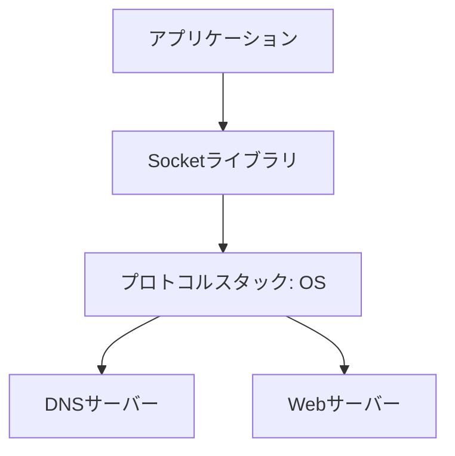
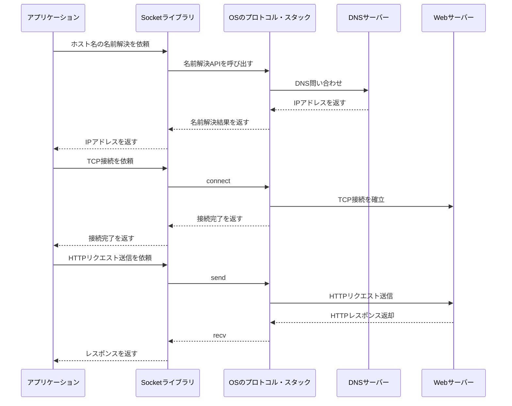

## はじめに

ネットワークを基礎から学び始めようと踏み出し、2回目の投稿です。
初回はHTTPリクエスト・レスポンスについて学び、HTTPプロトコルを使用しての、WebクライアントとWebサーバー間の通信を大まかに理解しました。
※詳細は以下の記事を見ていただけたらと思います🙇
[HTTPリクエスト・レスポンスとは何か](https://zenn.dev/to_kuhisa/articles/what-is-http-request-message)

本記事では、
「Webクライアントから目的のWebサーバーにHTTPリクエストを届ける際に、Socketライブラリはどんな役割を担っているのか」
を学習したいと思います。

まずは「Socketライブラリ」が何かを整理し、その後でHTTPリクエスト送信の流れの中でどのような役割を担っているのかを見ていきます。

## 結論

理解のポイントは次の2つです。

- Socketライブラリは、アプリケーションからOSの通信機能を利用するための窓口
- HTTPリクエストを送るときは、Socketライブラリを通じて名前解決、TCP接続、データ送受信が行われる

## 対象の読者

- [Socketライブラリが何かを簡単に知りたい方](#socketライブラリとは)
- [プロトコル・スタックとは何かを知りたい方](#プロトコル・スタックとは)
- [HTTPリクエスト送信の流れの中でSocketライブラリの役割を知りたい方](#httpリクエスト送信時のsocketライブラリの役割)

## 本題

### Socketライブラリとは

Socketライブラリを一言で言うと、アプリケーションがネットワーク通信を行うために使うAPI群です。

例えば、次のような処理を行うための入口になります。

- 接続先の名前を解決する
- 通信相手とTCP接続を確立する
- データを送る
- データを受け取る
- 接続を閉じる

代表的には、`socket`、`connect`、`send`、`recv`、`close` のような機能があります。
アプリケーションはこれらを直接使うか、HTTPクライアントやブラウザの内部で間接的に利用しています。

### プロトコル・スタックとは

プロトコル・スタックを一言で言うと、OSの中で通信そのものを実装している仕組みです。

例えば、次のような役割を担います。

- IPアドレスを使って相手先までパケットを届ける
- TCPで接続を確立し、順序や再送を制御する
- DNSを使ってドメイン名からIPアドレスを調べる

整理すると、アプリケーションがSocketライブラリを呼び出し、その先でOSのプロトコル・スタックが実際の通信処理を行います。

ここで、「アプリケーション」「Socketライブラリ」「プロトコル・スタック」の関係を簡単に整理します。



### HTTPリクエスト送信時のSocketライブラリの役割

ブラウザやHTTPクライアントがURLに対してHTTPリクエストを送るとき、内部では大まかに次の流れになります。

1. アプリケーションがURLからホスト名を取り出す
2. Socketライブラリ経由で名前解決を行い、IPアドレスを得る
3. Socketライブラリ経由で相手サーバーにTCP接続する
4. 接続済みの通信路にHTTPリクエストメッセージを書き込む
5. サーバーからHTTPレスポンスを受け取る

図にすると次のようなイメージです。



重要なのは、Socketライブラリ自体がHTTPを解釈しているわけではない点です。
Socketライブラリは「通信路を使うための窓口」であり、その上にHTTPというアプリケーション層のプロトコルが乗っています。

### 具体的に何を肩代わりしてくれるのか

今回の私の理解では、次のように考えると分かりやすかったです。

- アプリケーションは「どこへ接続し、何を送りたいか」を指示する
- Socketライブラリは、その指示をOSが扱える呼び出しに変換する
- プロトコル・スタックは、実際のパケット送受信や接続制御を行う

つまり、SocketライブラリはアプリケーションとOSの通信機能の橋渡し役と理解するようにしました。

### ターミナルで実際に確認してみる

ここまでの内容は概念の説明でした。
次は、macOS のターミナルで実際に確認してみます。

#### 1. ホスト名がIPアドレスに変換されることを確認する

まず、`example.com` がどのIPアドレスに対応しているかを確認します。

```bash
dscacheutil -q host -a name example.com
```

実行結果は次のようになりました。

```text
name: example.com
ipv6_address: 2606:4700::6812:1a78
ipv6_address: 2606:4700::6812:1b78

name: example.com
ip_address: 104.18.26.120
ip_address: 104.18.27.120
```

ここで確認できるのは、アプリケーションが扱いやすい `example.com` という名前が、実際には IPv4 や IPv6 のアドレスに変換されていることです。
HTTPリクエストを送る前に、まず接続先を特定する必要があるため、この名前解決は重要な前処理です。

#### 2. TCP接続できることを確認する

次に、Webサーバーの 80 番ポートへ接続できるかを確認します。

```bash
nc -vz example.com 80
```

実行結果は次のとおりでした。

```text
Connection to example.com port 80 [tcp/http] succeeded!
```

これは、HTTPメッセージを送る前段階として、TCPの通信路を作れることを確認していると考えられます。
Socketライブラリの `connect` に近い役割をイメージしやすい部分です。

#### 3. curl の詳細表示でHTTP送信の流れを確認する

最後に、`curl` の詳細表示を使って、名前解決、接続、HTTPリクエスト送信の流れを見ます。

```bash
curl -sv http://example.com -o /dev/null
```

実行結果の一部は次のようになりました。

```text
* Host example.com:80 was resolved.
* IPv6: 2606:4700::6812:1a78, 2606:4700::6812:1b78
* IPv4: 104.18.27.120, 104.18.26.120
*   Trying 104.18.27.120:80...
* Connected to example.com (104.18.27.120) port 80
> GET / HTTP/1.1
> Host: example.com
> User-Agent: curl/8.7.1
> Accept: */*
* Request completely sent off
< HTTP/1.1 200 OK
< Content-Type: text/html
```

この出力から、次の流れを読み取れます。

1. ホスト名 `example.com` がIPアドレスに解決される
2. 80番ポートへTCP接続する
3. `GET / HTTP/1.1` のようなHTTPリクエストが送信される
4. サーバーから `HTTP/1.1 200 OK` が返る

つまり、Socketライブラリはこの一連の処理の中で、名前解決や接続、送受信のための入口として機能していることが分かります。

### SocketライブラリのAPI名と実践内容の対応

ここまでの実践内容を、Socketライブラリでよく登場するAPI名と対応づけると次のようになります。

| APIや機能 | 役割 | 今回の実践で見えたこと |
| ---- | ---- | ---- |
| `socket` | 通信用のソケットを作る | `curl` や `nc` の内部で使われ、通信を始めるための入口になっている |
| 名前解決API | ホスト名からIPアドレスを得る | `dscacheutil -q host -a name example.com` で `example.com` がIPアドレスに変換されることを確認した |
| `connect` | 相手サーバーとのTCP接続を確立する | `nc -vz example.com 80` で 80 番ポートに接続できることを確認した |
| `send` | 接続済みの相手にデータを送る | `curl -sv http://example.com -o /dev/null` の `GET / HTTP/1.1` の送信部分として確認できた |
| `recv` | 相手からデータを受け取る | `HTTP/1.1 200 OK` や `Content-Type: text/html` が返ってきたことで確認できた |
| `close` | 通信終了後に接続を閉じる | 今回は明示的に表示していないが、`curl` や `nc` の終了時に内部で行われる |

このように見ると、ターミナルで確認した内容は単なるコマンド実行結果ではなく、Socketライブラリの各機能がどの場面で使われているかを観察したものだと分かります。

## まとめ

- Socketライブラリは、アプリケーションがOSの通信機能を利用するためのAPI群
- プロトコル・スタックは、OSの中でTCP/IPやDNSなどの通信処理を実行する仕組み
- HTTPリクエスト送信時には、Socketライブラリを通じて名前解決、TCP接続、データ送受信が行われる
- HTTPそのものはアプリケーション層のルールであり、Socketライブラリはその通信路を提供する

## 参考

- https://developer.mozilla.org/ja/docs/Glossary/Socket
- https://developer.mozilla.org/ja/docs/Glossary/TCP
- https://developer.mozilla.org/ja/docs/Learn_web_development/Extensions/Server-side/First_steps/Client-Server_overview
- 戸根 勤『ネットワークはなぜつながるのか 第2版 知っておきたいTCP/IP、LAN、光ファイバのしくみ』日経BP
